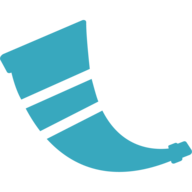

<h1 align="center">Ali Alaei</h1>
<h3 align="center">Product manager and Software-Hardware developer</h3>

  
  

<!--<h3>Contact Me</h3>

    
    
    
    

-->

 
 
 
 

    
    
    
    
    
    
    
    

<!--**alialaei110/alialaei110** is a ✨ _special_ ✨ repository because its `README.md` (this file) appears on your GitHub profile.-->

<!--Here are some ideas to get you started:

- 🔭 I’m currently working on ...
- 🌱 I’m currently learning ...
- 👯 I’m looking to collaborate on ...
- 🤔 I’m looking for help with ...
- 💬 Ask me about ...
- 📫 How to reach me: ...
- 😄 Pronouns: ...
- ⚡ Fun fact: ...

-->

<ul>
    <!-- <li>🔭 I’m currently working on <b>CVGen</b></li> -->
    <!--<li>🌱 I’m currently learning <b>JavaScript</b></li>
    <li>💬 Ask me about <b>Python</b> - <b>Django</b></li>-->
    <li>📫 How to reach me: <b><a href="ali.alaei.ac@gmail.com">ali.alaei.ac@gmail.com</a></b></li>
</ul>
